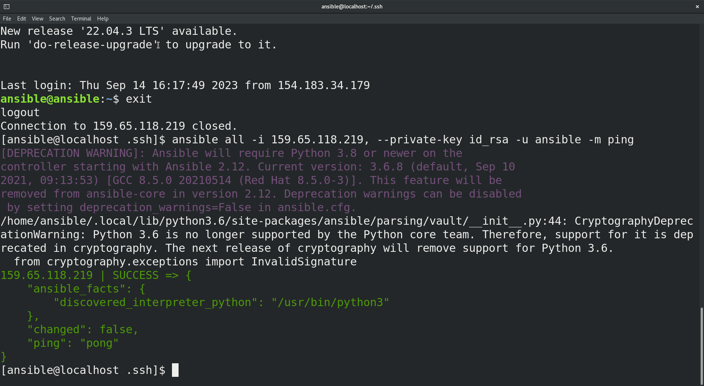
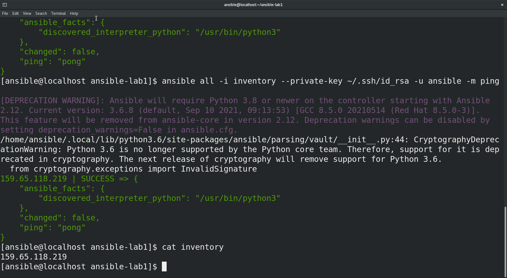
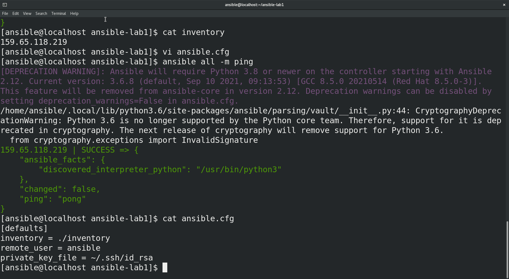
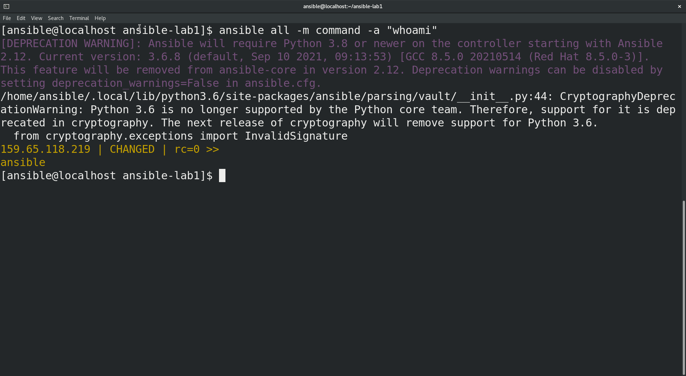
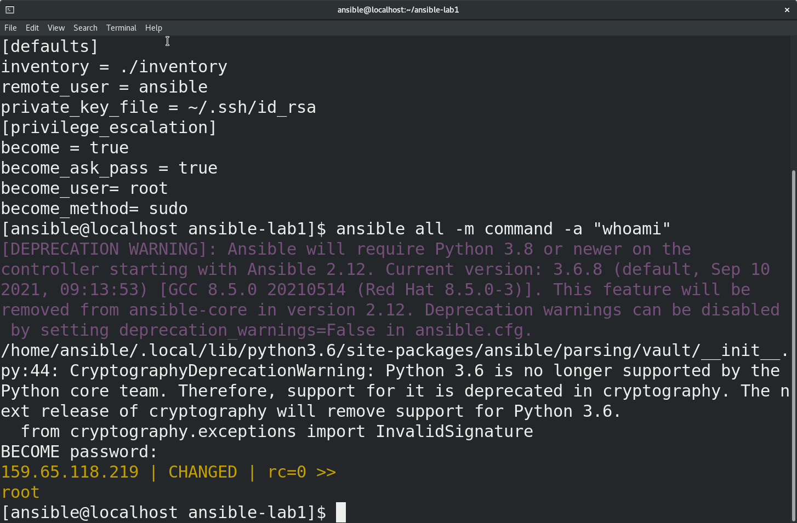

# Hossam Haggag Ansible Lab 1

<!-- insert images  -->

INSTALLING ANSIBLE & PREPARING SSH

## Screen Shot of success ssh using ip and key pair.

INVENTORY FILE

## Screen Shot of using inventory file insted of ip or multiple ips. 

CONFIGURATION FILE

## Screen Shot of using config file contains inventory location, remote user and private key location.

## Screen Shot of run ad-hock module with params

## Screen Shot of run ad-hock module with params (as root)

