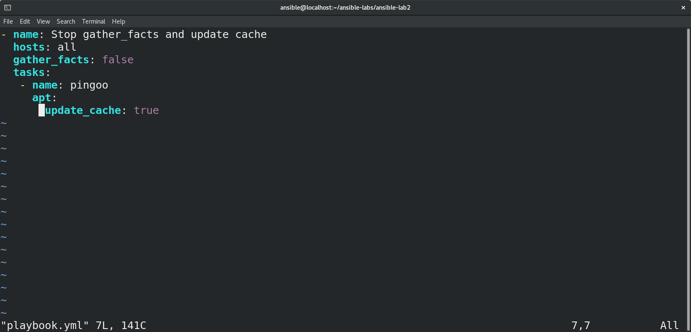
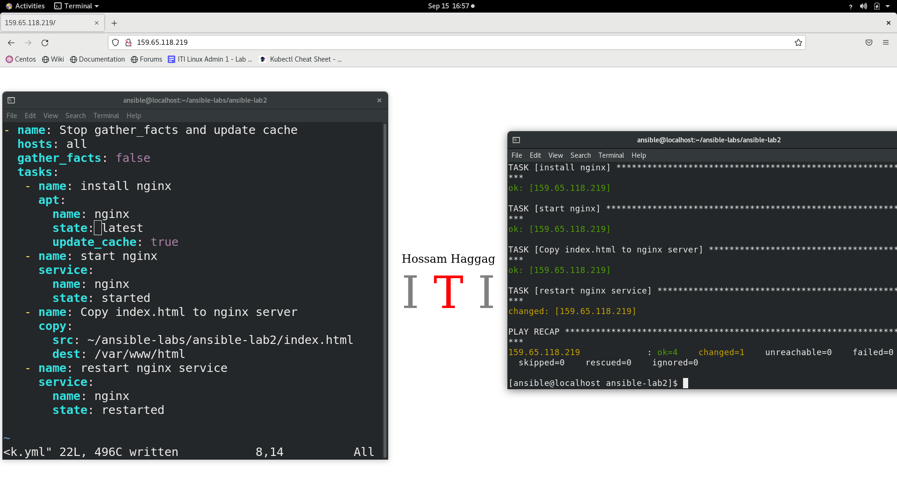
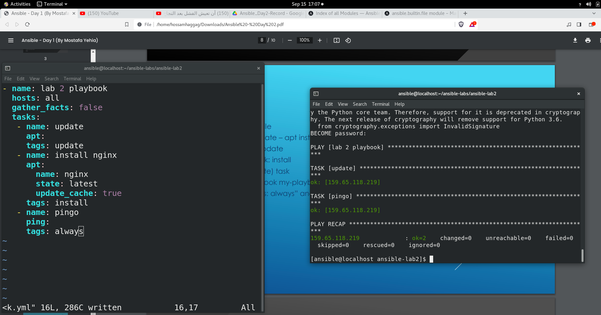
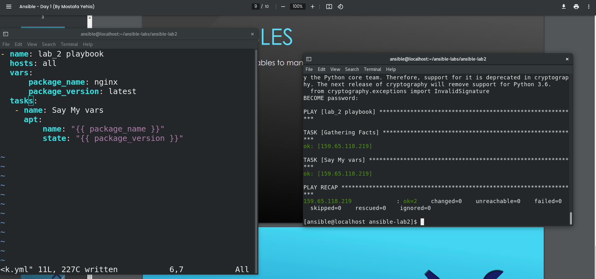
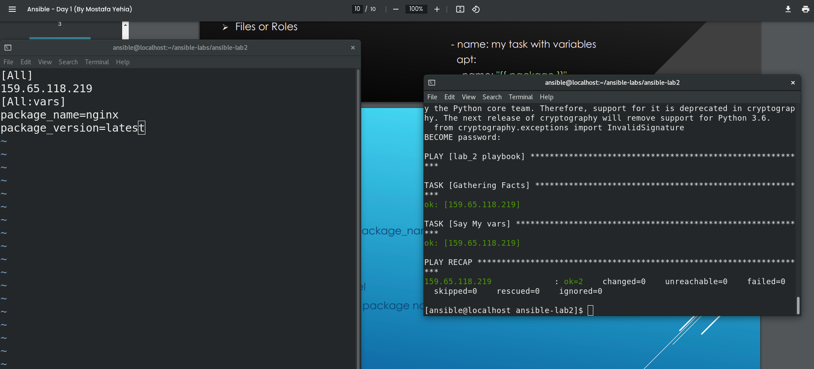
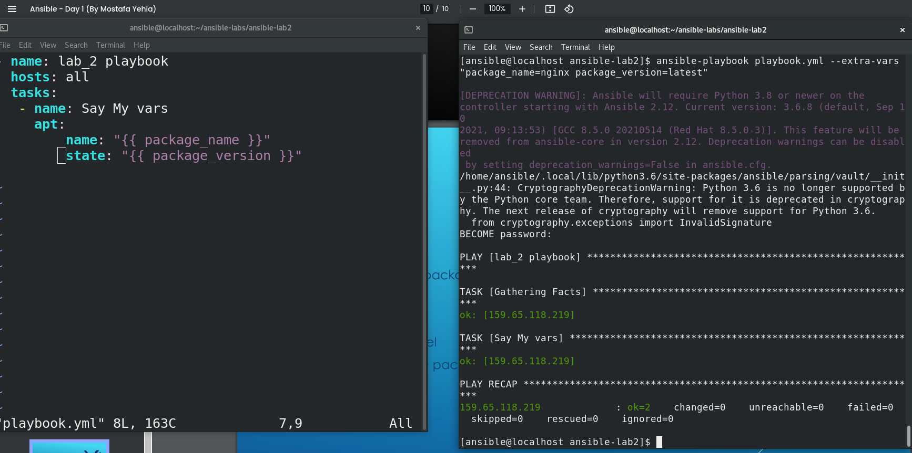

# Hossam Haggag Ansible Lab 2

<!-- insert images  -->

Very first Playbook

## Screen Shot of playbook stop gather_facts and enable update_cache.

 
 
 
 
 

First Module :
* Update cache
* Install latest nginx
* Copy index.html from controller to remote_host
* Restart nginx service

## Screen Shot of up and running web page configured using ansible playbook . 

 
 

 
 
 

Using Tags :
* Write simple playbook file
* Add two tasks (apt update – apt install nginx)
* Add tags to first task: update
* Add tags to second task: install
* Run only the (apt update) task
* Example: ansible-playbook my-playbook.yml --tags update
* Add one task with “tags: always” and run the previous command again

## Screen Shot of using tags in diffrent ways in ansible playbook . 

## Screen Shot of using tags in diffrent ways in ansible playbook . 

 
 

 
 
 

Using Vars:
Define these variables (package_name, package_version)
* on playbook level
* on inventory level
* on command line level
Use apt module with the package name and version from your variables

## Screen Shot of using variables on playbook level . 

## Screen Shot of using variables on inventory level . 

## Screen Shot of using variables on command-line level . 

