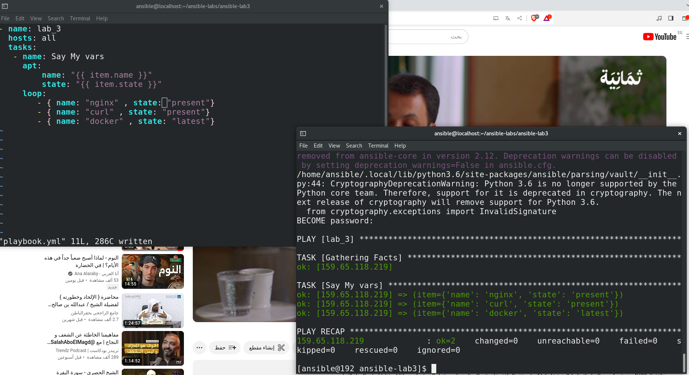
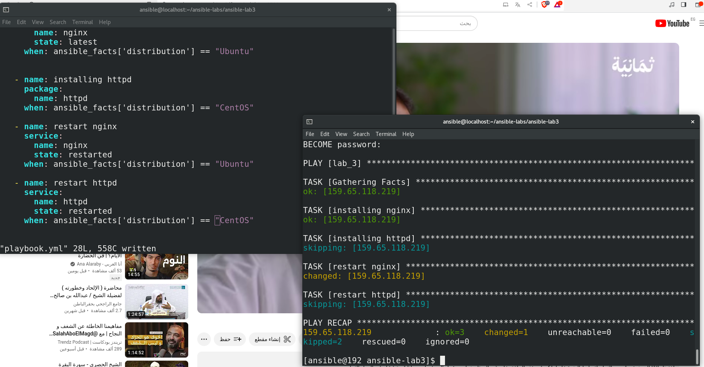
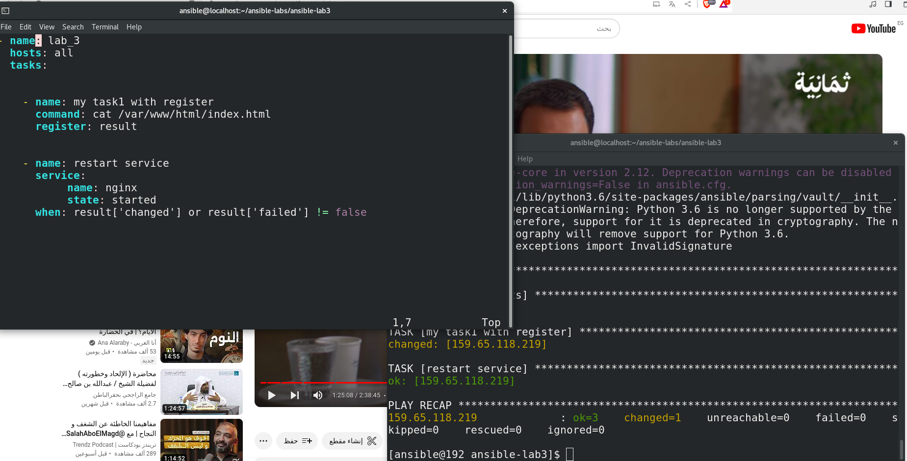

# Hossam Haggag Ansible Lab 3

<!-- insert images  -->

More practise on Playbook

### LOOPS

## Screen Shot of playbook with loops in files

 
 
 

WHEN

 
  

## Screen Shot of playbook with when condition in module

 
 
 

Rigester

 
 

## Screen Shot of playbook iclude Rigester with when condition in module. 

 
 

### The last two tasks are in playbook file. 
