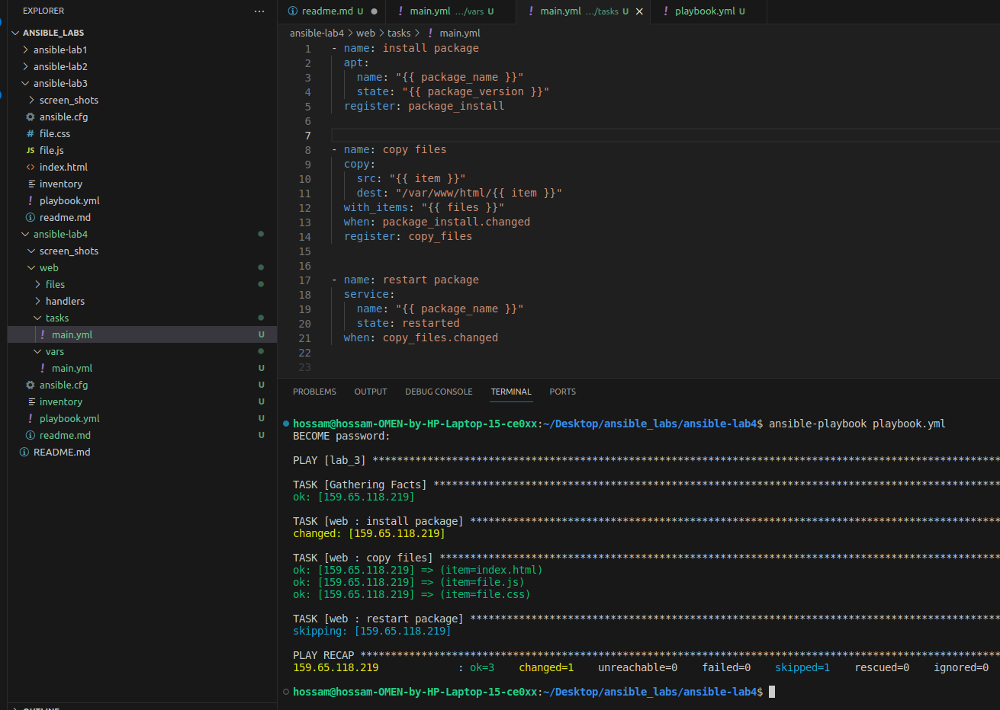
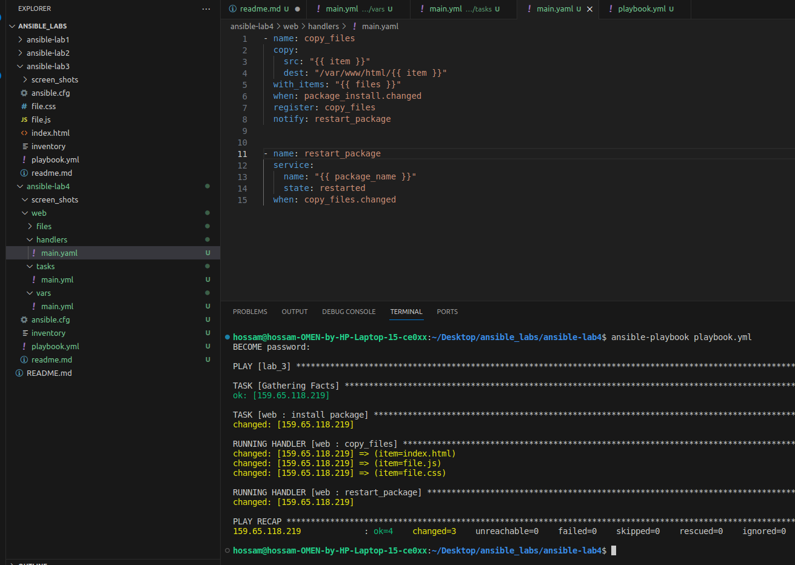
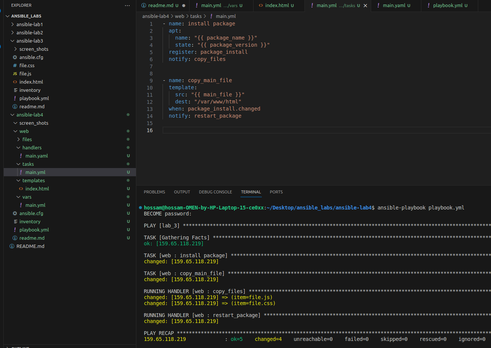

# Hossam Haggag Ansible Lab 4

<!-- insert images  -->

Make everything structured

### implement Roles with files

## Screen Shot of simple playbook using roles

 
 
 

### implement Roles with handlers

 
  

## Screen Shot of playbook using roles with handlers. 

 
 
 

### implement Roles with template and handlers

 
 

## Screen Shot of playbook using roles with template and handlers. 

 
 

### this was the last section in last lab in ansible Course .. I hobe you enjoy it.
### if you have any comments let me know 
